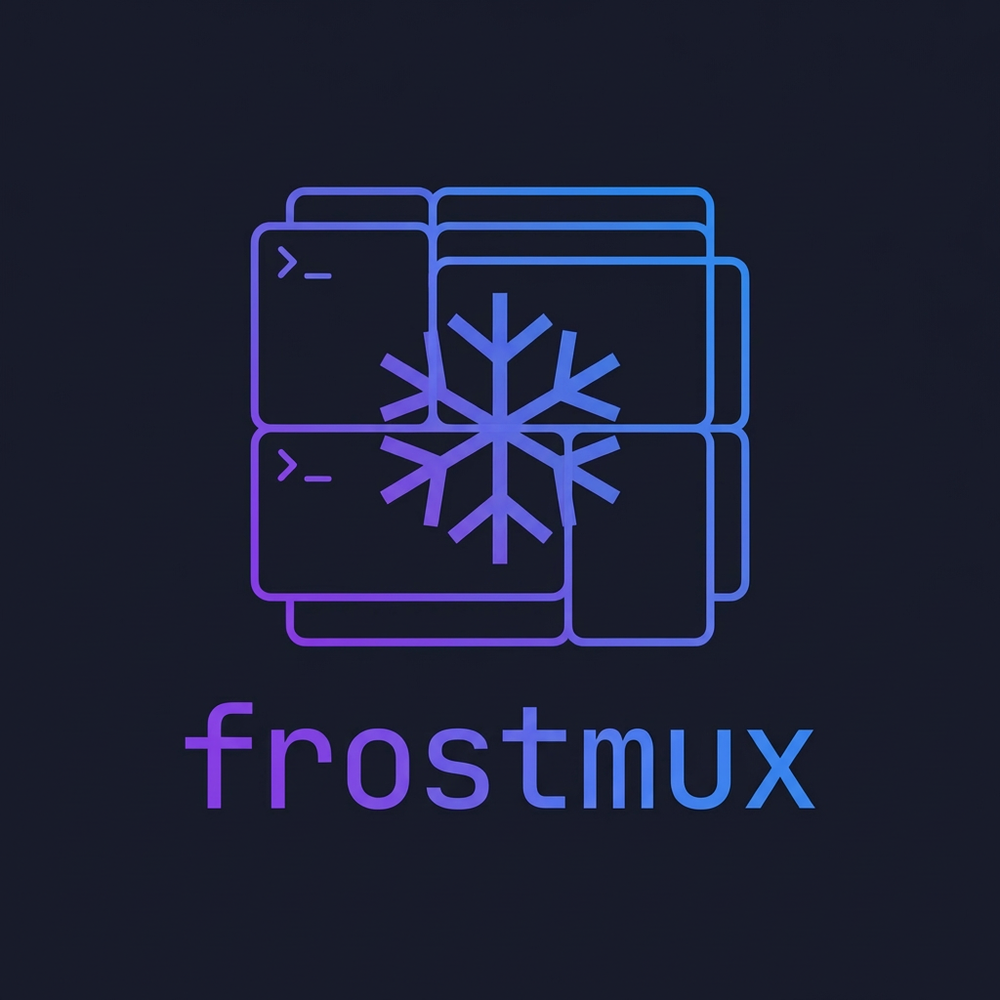

<p align="center">
  
</p>


<p align="center">A tmux session manager that writes your config for you.</p>

**Capture first, config second.** 

Arrange your tmux windows and panes the way you like them, freeze the layout to YAML, and replay it whenever you need it. No hand-written configs required.

## Requirements

- [tmux](https://github.com/tmux/tmux)
- [Go 1.21+](https://go.dev/dl/) (for installation)

## Install

```bash
go install github.com/lpuljic/frostmux/cmd/frostmux@latest
```

## Quick Start

```bash
# 1. Set up tmux however you want, then capture it
frostmux freeze my-project

# 2. Next time, replay it
frostmux start my-project
# or just
frostmux my-project
```

## Usage

### Freeze a running session

Captures your current tmux session (windows, panes, working directories, layout) and saves it as a YAML config.

```bash
frostmux freeze my-project    # saves to ~/.config/frostmux/my-project.yml
frostmux freeze               # prints config to stdout
```

### Start a session

```bash
frostmux start my-project
frostmux my-project            # shortcut
frostmux start -f ./custom.yml # start from a specific file
```

If the session already exists, frostmux attaches to it instead of creating a duplicate.

### Scaffold from project detection

```bash
cd ~/code/my-go-project
frostmux init
```

Detects your project type and generates a sensible config:

| Detected file    | Windows generated          |
|------------------|----------------------------|
| `go.mod`         | editor, build, test        |
| `package.json`   | editor, dev, test          |
| `Cargo.toml`     | editor, build, test        |
| `Makefile`       | editor, build, shell       |
| (none)           | editor, shell              |

### Other commands

```bash
frostmux list              # list saved configs
frostmux stop <project>    # kill a session
frostmux new <project>     # create a blank config and open in $EDITOR
frostmux edit <project>    # edit an existing config
frostmux delete <project>  # delete a config
```

## Config Format

Configs live in `~/.config/frostmux/` (override with `$frostmux_CONFIG` or `$XDG_CONFIG_HOME`).

### Shorthand: single command per window

```yaml
session: api
windows:
  - editor: nvim
  - server: go run ./cmd/server
```

Windows without a `root` default to `~`.

### Multi-pane shorthand

```yaml
windows:
  - logs:
      - tail -f app.log
      - tail -f error.log
```

### Full form: per-pane control

```yaml
windows:
  - code:
      root: ~/code/api
      layout: main-vertical
      panes:
        - command: nvim
        - command: go test ./...
          root: ~/code/api/tests
```

### Focus: choose where you land

By default frostmux selects the first window, first pane. Use `focus` to land somewhere else:

```yaml
session: my-project
focus: dev       # land on the "dev" window, pane 0
windows:
  - editor: nvim
  - dev:
      root: ~/code/my-project
      panes:
        - command: go run .
        - command: go test ./...
```

You can target a specific pane with `window.pane`:

```yaml
focus: dev.1     # land on the "dev" window, second pane
```

When you `freeze` a session, frostmux captures whichever window and pane you're currently looking at.

### Mixed: all three in one config

```yaml
session: my-project
windows:
  - editor: nvim
  - notes:
      root: ~/Documents/notes
      panes:
        - command: ""
  - dev:
      root: ~/code/my-project
      layout: tiled
      panes:
        - command: go run .
        - command: go test ./...
```

## Shell Completion

```bash
# zsh (~/.zshrc)
eval "$(frostmux completion zsh)"

# bash (~/.bashrc)
eval "$(frostmux completion bash)"

# fish (~/.config/fish/config.fish)
frostmux completion fish | source
```

## Layouts

Standard tmux layouts: `even-horizontal`, `even-vertical`, `main-horizontal`, `main-vertical`, `tiled`.

## Credits

Inspired by [smug](https://github.com/ivaaaan/smug) and [tmuxinator](https://github.com/tmuxinator/tmuxinator).
